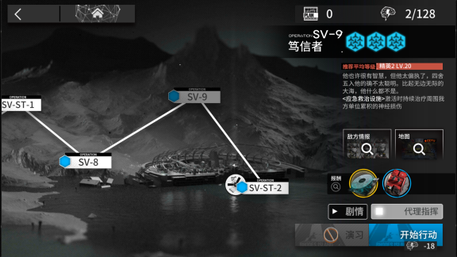

# Arknights-Sora
> 明日方舟-清空理智py脚本  

本项目以学习python语法为初衷而创建，  
所使用的代码参考某位大佬[hgjazhgj](https://github.com/hgjazhgj)的[FGO全自动脚本](https://github.com/hgjazhgj/FGO-py)  

[版本记录](#版本记录-Version-Logs)  
GitHub项目地址:[https://github.com/zsppp/Arknights-Sora](https://github.com/zsppp/Arknights-Sora)  
适用于明日方舟简体中文安卓版本,运行在包含Python3.7或更高版本的Windows上（Ubuntu也行）  

Gitee平台包含pyinstaller打包的可执行软件包  
Gitee项目地址:[https://gitee.com/zsppp/Arknights-Sora/releases](https://gitee.com/zsppp/Arknights-Sora/releases)  

# 警告 Warning
***
[鹰角网络游戏使用许可及服务协议](https://www.hypergryph.com/service)第6条规定:  
除非适用法律允许或鹰角网络事先书面同意，您不得在使用鹰角网络游戏软件和鹰角网络游戏服务过程中实施以下行为  
通过非鹰角网络开发的或未经授权的第三方软件、插件、外挂、系统，使用鹰角网络游戏软件及鹰角网络游戏服务，或制作、发布、传播任何形式的妨碍游戏公平性的辅助工具或程序（您同意以游戏程序中的监测数据和异常表现作为判断用户是否存在使用非法外挂等方法的行为）  
若您实施了违反适用法律或本协议禁止的任何行为，则鹰角网络有权依据您违规行为的具体情节，并依据适用法律及本协议的规定决定对您采取以下一项或多项措施，并决定每一项措施的具体时限和内容：  
1) 向您发出警告，多次警告可能会带来一定的后果；  
2) 立即断开您当前使用的终端与游戏服务器之间的网络连接，您必须重新登录才能继续使用鹰角网络游戏软件或服务；  
3) 暂时或永久地禁止您在游戏中发表任何言论；  
4) 限制或禁止使用部分或全部功能，如禁止您使用游戏中某一要求付费的功能，直至您清偿所欠费用并为继续使用上述付费功能而预先支付相应的费用之日止；  
5) 删除部分或全部游戏数据，如角色、积分、等级、装备、道具等；  
6) 暂时或永久禁止您使用当前账号登录鹰角网络游戏软件；  
7) 立即中止或终止向您提供鹰角网络游戏软件和/或鹰角网络游戏服务；  
8) 注销您的游戏账号；  
9) 解散游戏内组织，如帮派、工会、势力等具有同等性质的组织；  
10) 对于人物昵称、帮派名称、摊位名称、商店名称、宠物名称、召唤兽昵称、空间名称等可以由您自主命名的昵称或名称进行强制修改；  
11) 将违规交易恢复至违规行为发生之前的状态；  
12) 扣除违规交易中，违规一方或违规双方所获得的游戏虚拟物品或游戏虚拟货币；  
13) 冻结或收回游戏虚拟物品或游戏虚拟货币，限制其使用或转让；  
14) 屏蔽、删除或采用其他途径防止他人查看或分享您发表的言论；  
15) 要求您赔偿由此给鹰角网络或他人带来的所有损失；  
16) 移交有关行政管理机关给予行政处罚；  
17) 追究您的刑事责任；  
18) 其他鹰角网络认为合理的措施。  
若您有任一账号存在违反本协议及其他相关规定的，鹰角网络有权对您的所有账号采取前述措施。  

**由于使用本脚本(Arknights-Sora)而导致的包括但不限于上述各项的损失本人概不负责,您下载并使用该脚本即代表您已知晓使用脚本可能带来的风险并愿意承担可能出现的后果**   
***

# 使用说明 Instruction  
双击运行`main.py`，启动**Arknights-Sora**  
进入需要连续行动的关卡，在开始行动界面点击Start按钮  
  
  
  
  
# 建议事项 Suggestions  

1. 仅适用于支持adb调试的安卓模拟器，若是通过adb连接安卓手机需要开启开发者模式  
  
2. 若脚本运行过程中遇到报错ConnectionAbortedError，请重启脚本。暂时不清楚原因  
  
3. 无法连接夜神模拟器  [issue #3](https://github.com/zsppp/Arknights-Sora/issues/3)
adb client、server 版本不一致会导致连接不上模拟器，且出现报错  
`adb server version (36) doesn't match this client (40); killing...`  
解决办法：  
确保脚本和模拟器使用相同版本的adb  
脚本adb路径`airtest\core\android\static\adb\windows\adb.exe`  
夜神模拟器adb路径`bin\nox_adb.exe`  
可以把 nox_adb.exe 覆盖到 adb.exe，反过来也可以  
  
  
4. 如果出现其它adb连接的问题，试试打开任务管理器干掉 adb.exe 进程，再重新启动脚本  
  
  

注：  
本人使用的是雷电模拟器4.0.44 ，脚本属于自用自测。  

# 版本记录 Version Logs
## 2022/07/04 v1.1.6  
修复图片坐标未根据模拟器的分辨率进行转换，导致点击操作失败
[issue #4](https://github.com/zsppp/Arknights-Sora/issues/4)  

## 2022/05/03 v1.1.5  
根据新活动UI调整操作逻辑  

## 2021/11/22 v1.1.3  
修复bug，暂停操作会导致初始化airtest  

## 2021/11/20 v1.1.2
增加在截图和点击出现报错时，重新初始化airtest的逻辑  

## 2021/11/13 v1.1.0
复习python语法，重写了arkFunc.py  
主体功能逻辑没有变  

## 2021/09/17 v1.0.7
1，调整“接管作战”图片识别坐标
2，调整代码逻辑：adb连接放在start之后

## 2021/08/03 v1.0.6
`README.md` 增加 [issue #3](https://github.com/zsppp/Arknights-Sora/issues/3) 夜神模拟器adb连接不上的问题的解决办法  
[issue #2](https://github.com/zsppp/Arknights-Sora/issues/2) 也提到了该问题  

## 2021/07/03 v1.0.5
1，bug修改  
“联锁竞赛-荷谟伊智境”的“开始行动”位置与常规图的稍微有偏差，脚本点击位置不正确
调整点击“开始行动”坐标
  
2，代码调整  
鹰角终于实装了一键领取，所以重新截取“日常任务”的识别图片  

3，UI新增“Settings-debug”可以打开显示debug调试信息

## 2021/06/03 v1.0.4  
修改bug  
1，不同设备显示的图片位置可能稍微有点错位，出现匹配不上的问题。  
调整图片匹配坐标，放宽数值。  

代码调整  
2，关闭界面自动断开adb连接  

## 2021/05/26 v1.0.3  
新增 清空理智后自动领取每日、访问基建领取线索

## 2021/05/09 v1.0.2  
新增  
1，脚本结束后，windows任务栏图标提示  
计划增加：   
2，增加图片识别：代理指挥、代理指挥失败  
~~3，刷完理智自动领取每日奖励~~  
4，ocr识别公招  
  
## 2021/03/14 v1.0.1  
修复若干bug  
1，新增识别理智液图片添加判断：清空理智液后停止脚本  
当输入的理智液数量大于实际数量，会在“点击开始行动”和“取消使用源石”之间循环  
引起不必要的恐慌  
2，bug修复：设置预定行动次数概率不生效  
调整判断满足行动次数逻辑的代码位置  

